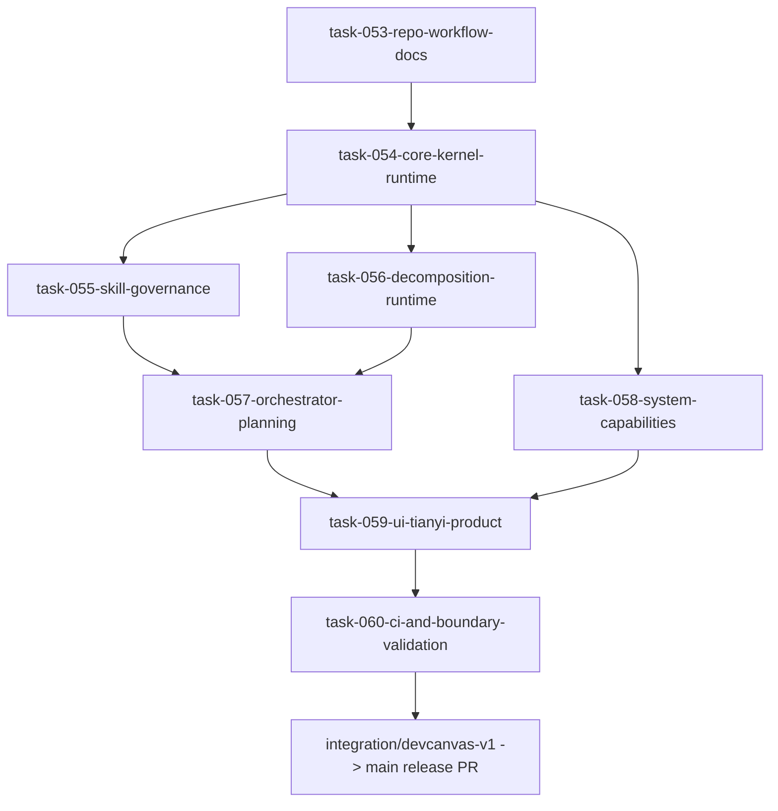

# DevCanvas Repo Integration Map v1

## Goal

Move the verified local DevCanvas implementation from `/Users/m4-zhi/Documents/codex-workspace/天衍/new` into a GitHub-native, PR-driven workflow without changing runtime behavior or adding new systems.

## Source And Target

- Local source of truth: `/Users/m4-zhi/Documents/codex-workspace/天衍/new`
- Target repository: `dodabojcuk-sys/devcanvas-ai-writer`
- Stable branch: `main`
- Integration branch: `integration/devcanvas-v1`

## Migration Mapping

| Local source | Repository target | Notes |
| --- | --- | --- |
| `new/core/**` | `core/**` | Kernel, planning, orchestration, eventline, and runtime helpers. |
| `new/runtime/**` | `runtime/**` | SystemAdapter, audit, enforcement, session, Tianyi runtime helpers. |
| `new/system/**` | `system/**` | Capability modules only; no UI entry. |
| `new/types/**` | `types/**` | Shared type definitions. |
| `new/app/**` | `app/**` | Tianyi product UI and app routes. |
| `new/ui/**` | `ui/**` | UI support components. |
| `new/tests/**` | `tests/**` | Node test suite and source-boundary tests. |
| `new/tools/**` | `tools/**` | Boundary audit and validation scripts. |
| `new/package.json` | `package.json` | Runtime scripts after integration review. |
| `new/tsconfig*.json` | `tsconfig*.json` | Typecheck/test configs after integration review. |

Excluded from migration:

- `.next/`
- `.tmp/`
- `.DS_Store`
- build caches
- generated reports unless a validation task explicitly requires them

## PR Split Graph

## PR Definitions

### task-053-repo-workflow-docs

Scope:

- `docs/protocol/github-dev-protocol-v1.md`
- `docs/architecture/devcanvas-repo-integration-map-v1.md`
- `.github/PULL_REQUEST_TEMPLATE.md`

Purpose: establish the GitHub workflow before code migration.

### task-054-core-kernel-runtime

Scope:

- `core/kernel/**`
- `runtime/systemAdapter/**`
- `runtime/audit/**`
- `runtime/enforcement/**`
- `runtime/session/**`
- core runtime tests

Purpose: migrate the execution kernel and runtime boundary.

### task-055-skill-governance

Scope:

- `core/kernel/skillExecutionGate.ts`
- `core/kernel/skillExecutionRouter.ts`
- `core/kernel/skillExecutionTrace.ts`
- skill governance docs
- skill governance tests

Purpose: migrate the skill-governed execution control layer.

### task-056-decomposition-runtime

Scope:

- `core/runtime/decompositionRuntimeEngine.ts`
- `core/runtime/narrativeFlowBridge.ts`
- `core/runtime/narrativeRuntimeLoop.ts`
- docs 62-64
- runtime preprocessing tests

Purpose: migrate deterministic story decomposition and one-tick runtime state.

### task-057-orchestrator-planning

Scope:

- `core/planning/**`
- `core/orchestration/**`
- docs 65-66
- planner and orchestrator tests

Purpose: migrate planning and unified orchestration.

### task-058-system-capabilities

Scope:

- `system/**`
- system-only tests

Purpose: migrate capability implementations without exposing new UI/system entrypoints.

### task-059-ui-tianyi-product

Scope:

- `app/tianyi/**`
- `app/globals.css`
- `ui/**`
- UI/source tests

Purpose: migrate the Tianyi product writing surface.

### task-060-ci-and-boundary-validation

Scope:

- `package.json`
- `tsconfig*.json`
- `tools/**`
- CI workflow if absent
- final validation docs

Purpose: make the integrated repository buildable and auditable.

## Integration Acceptance

- Each task PR has one primary module scope.
- Every PR includes Skill Report and router/gate/trace summary.
- Protected layer PRs include boundary audit notes.
- Final integration branch passes typecheck, tests, boundary audit, and build.
